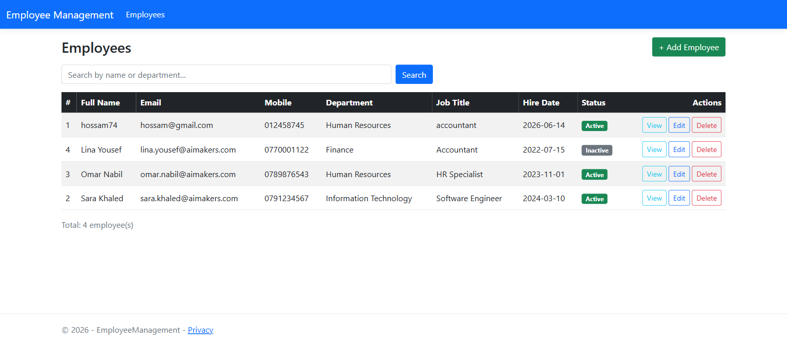
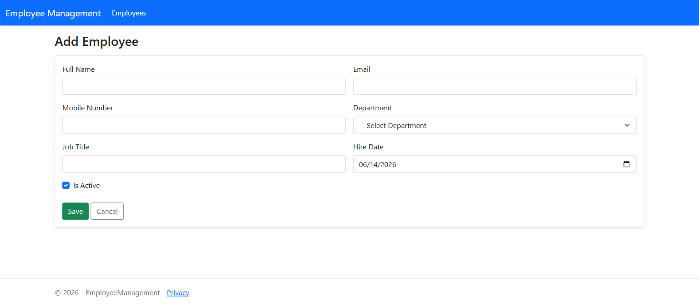
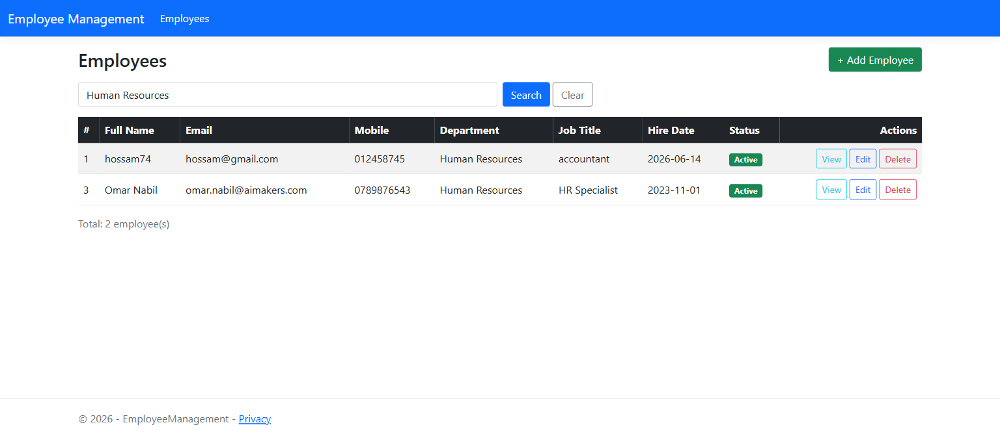
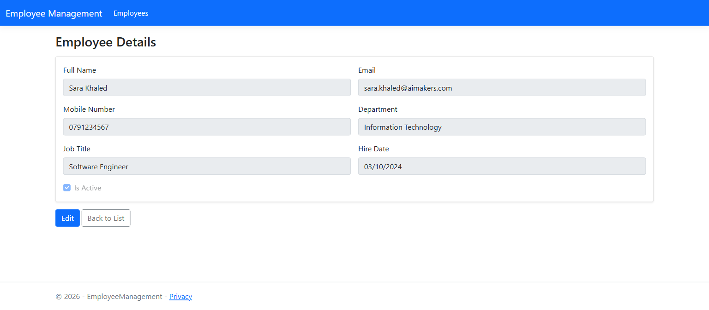
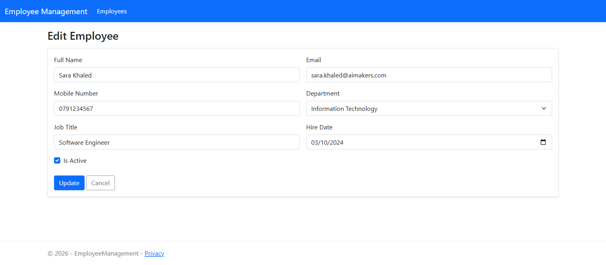
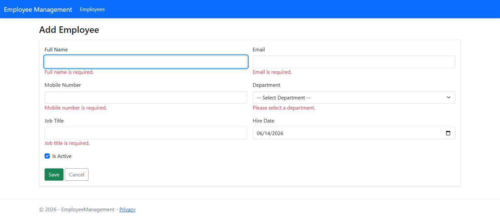

# Employee Management Mini System

A small Employee Management system built with **ASP.NET Core MVC (.NET 8)**, **Entity Framework Core (Code-First)** and **SQL Server**. It supports full CRUD on employees, searching, and links each employee to a department.

> Built as the technical assessment for the .NET Developer position at AI Makers.

---

## Features

- ➕ Add a new employee
- ✏️ Edit employee information
- 🗑️ Delete an employee
- 📋 View employees in a table/list
- 🔎 Search employees by **name** or **department**
- 🏢 `Department` table with employees linked via a foreign key
- ✅ Server-side and client-side validation (Data Annotations)
- 🌱 Database auto-created and seeded with departments on first run

## Employee fields

| Field | Notes |
|-------|-------|
| Employee ID | Primary key (auto) |
| Full Name | Required, max 150 chars |
| Email | Required, valid email, **unique** |
| Mobile Number | Required, phone format |
| Department | Required, foreign key to `Department` |
| Job Title | Required |
| Hire Date | Required, date |
| Is Active | Boolean |

## Tech stack

- ASP.NET Core MVC (.NET 8) + C#
- Entity Framework Core 8 (Code-First migrations)
- SQL Server (LocalDB by default)
- HTML, CSS, JavaScript, Bootstrap 5
- Git / GitHub

## Architecture

The project follows a layered structure (Repository + Service pattern):

```
Controllers  ->  Services  ->  Repositories  ->  EF Core DbContext  ->  SQL Server
```

- **Models/** – `Employee`, `Department`
- **Data/** – `AppDbContext` (configuration + seed data)
- **Repositories/** – data-access layer (`IEmployeeRepository`, `IDepartmentRepository`, …)
- **Services/** – business logic (`IEmployeeService`, `IDepartmentService`, …)
- **Controllers/** – `EmployeesController`
- **Views/Employees/** – Index, Create, Edit, Details, Delete (+ shared `_Form` partial)

---

## How to run

### Prerequisites
- [.NET 8 SDK](https://dotnet.microsoft.com/download)
- SQL Server — **LocalDB** (ships with Visual Studio) works out of the box

### Steps

1. Clone the repository:
   ```bash
   git clone https://github.com/HossamAhmed74/EmployeeManagement.git
   cd EmployeeManagement
   ```

2. (Optional) Update the connection string in `EmployeeManagement/appsettings.json` if you are not using LocalDB:
   ```json
   "ConnectionStrings": {
     "DefaultConnection": "Server=YOUR_SERVER;Database=EmployeeManagementDb;Trusted_Connection=True;TrustServerCertificate=True"
   }
   ```

3. Run the application:
   ```bash
   cd EmployeeManagement
   dotnet run
   ```
   The database and seed data are created **automatically** on startup (`db.Database.Migrate()`).

4. Open the app in your browser:
   - http://localhost:5003

### Database setup options

- **Automatic** – just run the app; migrations are applied on startup.
- **EF CLI** – `dotnet ef database update`
- **SQL script** – run `Database/EmployeeManagementDb.sql` against your SQL Server instance.

---

## Project structure

```
.
├── EmployeeManagement.sln
├── README.md
├── Database/
│   └── EmployeeManagementDb.sql      # Generated SQL script (schema + seed)
└── EmployeeManagement/
    ├── Controllers/
    ├── Data/
    ├── Models/
    ├── Repositories/
    ├── Services/
    ├── Migrations/                   # EF Core migration files
    ├── Views/
    ├── wwwroot/
    ├── appsettings.json
    └── Program.cs
```

---

## Screenshots

| Employees list | Add employee |
|---|---|
|  |  |

| Search by name/department | View (read-only) |
|---|---|
|  |  |

| Edit employee | Validation |
|---|---|
|  |  |

---

## Notes

- Email is enforced unique at the database level and validated in the controller.
- Departments cannot be deleted while employees are linked to them (`DeleteBehavior.Restrict`).
- The app opens directly on the Employees list.
